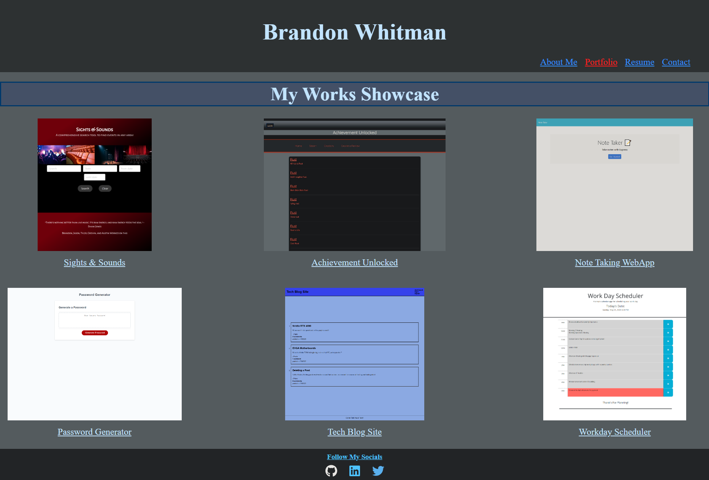

# React Portfolio
  
  ## Description
  This is a recreation of my portfolio from the beginning of my cohort using React. While mostly a refactor, I have added a few bells and whistles. I will be continuing to work on this portfolio
   

  ## Table of Contents
  - [Installation](#installation)
  - [Contributing](#contributing)
  - [Tests](#tests)
  - [Languages](#languages)
  - [Questions](#questions)
   

  ## Screenshot and Deployed Link
  
   
  <a href="https://bwhitman33.github.io/portfolio"> View Deployed Portfolio Here!</a>
   
  
  ## Installation
  See below for any of this project's dependencies - 
  Run npm i after cloning repo and follow the  build and start scripts to launch application.
   

  ## Contributing
  Brandon Whitman
   

  ## Tests
  n/a
   

  ## Languages Used
  JavaScript, CSS, HTML, and React
   

  ## Questions
  Any questions can be asked at Bwhitman33@gmail.com. 
    
  The github repository for this project can be found at [Bwhitman33](https://github.com/Bwhitman33/React-Portfolio)
